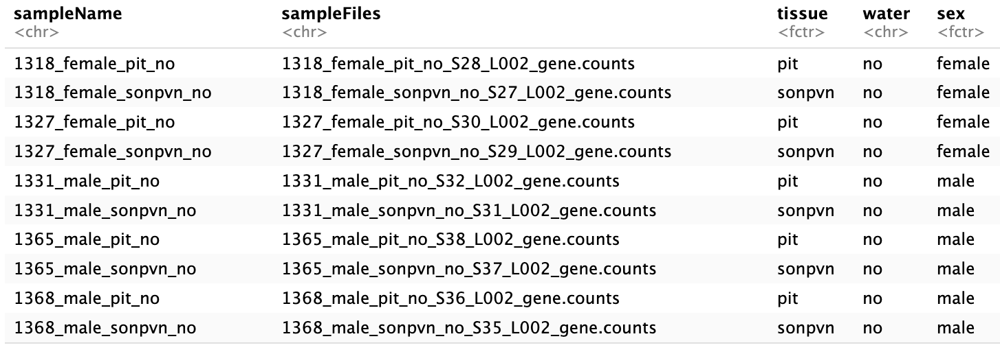

# GenBio_Final_Project
**By Sarah Couture**

## Study Introdution & Background 
  As our planet undergoes unprecedented climate change, an estimated 34% increase in the next century of the surface area of arid deserts has been predicted (IPCC, 2019; Mirzabaev et al., 2019; Wu et al., 2014). With this prediction comes the increase importance in studying how environmental implications induce physiological adaptation and overall ecological evolution, leading us on our mission to uncover the mechanisms behind how these desert animals survive (Bittner et al., 2021; Bradford, 59 1974; Cortés et al., 2000; Kordonowy et al., 2017; MacManes, 2017; MacMillen and 60 Hinds, 1983; Nagy, 1987; Tigano et al., 2020). In comes the desert specialist known as the cactus mouse, Peromyscus eremicus, home to southwestern United States and exhibits behavioral (Murie, 1961; Veal and Caire, 1979), physiological (Colella et al., 2021b; Kordonowy et al., 2017; Macmillen, 1965), and molecular (MacManes, 2017) adaptations to desert environments. Due to behavioral changes of desert animals being so dynamic and reversible, focusing on physiological adaptation and how it has occurred across evolutionary scales may be more efficient in answering the big question. For example, previous genomic studies provide evidence of positive selection in desert adapted rodents ranging from genes involved in energy production, to food storage (Jirimutu et al., 2012; Wu et al., 2014), water reabsorption (Giorello et al., 2018; Jirimutu et al., 2012; Marra et al., 2012; Marra et al., 2014; Yang et al., 2016), and osmoregulation (Colella et al., 2021a; Kordonowy and MacManes, 2016; MacManes and Eisen, 2014). However, we still don’t fully comprehend the relationship between reproduction and water regulation.

  The relationship between reproductive and systemic physiological function has long been of interest to biologists, though the ways in which function is coordinated remains elusive. One potential mechanism of coordination is the co-regulation of genes important in different functional domains. One specific example, the potential co-regulation of gonadal steroid hormones and vasopressin (AVP) may link reproduction with the maintenance of water and solute balance, both critically important processes in animals. In rats, neuronal expression of vasopressin has been shown to be estrogen dependent, though the relationship between non-neuronal AVP and estrogen is currently unknown. In addition, it has been shown that an increase in non-neuronal AVP gene expression, important for water retention when access to water is limited, decreases sperm counts and motility in male lab mice, and negatively effects embryo development and litter size in female lab mice. To highlight the potential connections between dehydration and fertility in mice accustomed to limited access to drinking water, we have conducted an RNAseq-style gene expression study using a model desert-adapted mammal, the cactus mouse (Peromyscus eremicus), which can survive without water. Using specific nuclei important to the maintenance of water balance (SON and PVN of the hypothalamus) as well as the pituitary, we quantify differences in gene expression in groups of mice exposed to two different water treatments – one where water is freely available and one where water is withheld completely. We use these data to as a first step towards understanding the impacts of dehydration on fertility in a desert-adapted animal. 

## Methods 
 -Extracted (n=20) brains from female (n=10) or male (n=10) Peromyscus eremicus that were either hydrated (free access to water) or dehydrated (no access to water for 72 hours). 
 -Extracted the RNA from each tissue sample (SON, PVN, & pituitary) utilizing a typical Trizol protocol. 
 -Performed library preparation to isolate mRNA of tissue samples and amplify each tissue sample. 
 -Performed bulk RNA sequencing on all tissue samples to observe the gene expression profile of each transcript. 
 -Indexed and mapped samples utilizing the UNH Premise cluster.  

Figure 1. The bulk RNA sequencing pipeline 

Raw reads then went through quality control and multiqc platforms, followed by the selection of particular samples following a PCA plot. Samples were then mapped to a reference genome utilizing the STAR index, and all visual analysis was compelted using the R platform. The code can be found here: https://github.com/SarahCouture3599/GenBio_Final_Project/blob/main/Code.sh

## Results 

Figure 2. Sample Table showing the head (10) of each individual sample name, the associated gene.count file, the specific tissue extracted, the treatment received ("yes" water or "no" water), and sex. 

 and hypothalamus (sonpvn) of _P. eremicus_. The axes are labeled with the proportion of data explained by principal comonent 1 (tissue type) and 2 (water treatment).  

 in both males and female _P. eremicus_ with or without access to water. The log fold change being on the y axis, and the mean normalized counts on the x axis. 

 in both males and female _P. eremicus_ with or without access to water. The log fold change being on the y axis, and the mean normalized counts on the x axis. 

 on the x axis of MUP4 gene expression in the pituitary. 

 on the x axis of MUP4 gene expression in the hypothalamus (sonpvn).

 for both hydrated (yes) and dehydrated (no) samples. Genes are on the y axis,  female samples are the on the x axis, and according tissue/treatment is colored-coded on the top. 

## Discussion 
  Water balance is complex and is in part thought to be modulated by reproductive hormones and their associated reproductive receptors found throughout the body. In rats, neuronal expression of vasopressin has been shown to be estrogen dependent, though the relationship between non-neuronal AVP and estrogen is currently unknown. In addition, it has been shown that an increase in non-neuronal AVP gene expression, important for water retention when access to water is limited, decreases sperm counts and motility in male lab mice, and negatively effects embryo development and litter size in female lab mice. Here we expand on the long history of organismal water management studies in desert taxa (Bradford, 1974; MacMillen and Hinds, 1983; Frank, 1988; Hayes et al., 1998; Cortés et al., 2000; Albright et al., 2017; MacManes, 2017) to assess the relationship between reproduction and physiological adaptation to a dry environment. We demonstrate here that there is some sort of connection due to the differences in gene expression in the hypothalamus (sonpvn) and pituitary in female cactus mice versus male cactus mice. These results support the hypothesis that dehydration may impact fertility in female desert-adapted mammals. 
   
  Appropriate tissue and treatment grouping, along with correct sample naming was confirmed via a principle component analysis (Figure 3). The confirmation in the number of differentially expressed genes in both the pituitary and hypothalamus (sonpvn) for both desert-adpated females and males revealed 4221 genes upregulated and 4631 genes downregulated (Figure 4). Individually, there were 446 genes upregulated and 376 genes downregulated in the pituitary (Figure 5), and 129 genes upregulated and 90 genes downregulated in the hypothalamus (sonpvn) (Figure 6). These numbers point to the finding that the pituitary had a higher number of upregulated and downregulated genes, which concurs when you consider all of the complex functions and systemic pathways the pituitary is a part of in comparison to the son & pvn specifically. Sex differences in the MUP4 (major urinary protein 4) gene expression per treatment for both the pituitary and hypothalamus (sonpvn) are visually seen in the bean plots in Figures 7 & 8. These sex, treatment, and tissue correlated differences show high potential probability of dehydrational impacts on and correlation to fertility in female desert-adapted animals on both a gene expression and correlated gene functional level. Lastly, to gain more insight into the top differentially expressed genes in the pituitary and hypothalamus (sonpvn) of female desert-adapted mammals, a pheatmap (Figure 9) was constructed and analyzed. Four genes were found to be substantially downregulated in female desert-adapted hypothalamus (sonpvn) tissue, and 6 genes were substantially up regulated in female desert-adapted pituitary tissue. Further gene ontology (GO) term and KEGG Pathway analysis will needed to be done to connect dehydration-specific genes of interest with correlated systemic pathways present in both desert-adapted and non desert-adpated animals. 
 
  _Conclusions_ 
  Desert-adapted species offer a unique opportunity to study how organisms survive some of the harshest habitats on Earth. The main challenges to survival in desert habitats are maintaining water balance and thermoregulation, with the nature of fertility being critically important, particularly to the former. We have shown a potential link between fertility and dehydration, yet futher analysis needs to be done to further hone in on this connection and the correlated genetic impacts. Howver, regardless of more analysis needing to done, we have still successfully taken the first steps in addressing the elusivness of reproducibility and arid desert adaptation.  

## Future Directions 
 -Gene ontology term analysis for a more comprehensive view of differential expression.
 -Comparisons of hydrated/dehydrated P. eremicus brain to hydrated/dehydrated Mus musculus brain, which is not desert adapated.
 -Spatial transcriptomic analysis of P. eremicus hypothalamus to elucidate further spatial information about gene expression patterns.

## Acknowledgments 
 -Dr. Matthew MacManes, Sarah Nicholls, Dani Blumstein, Zahra Alim, Disha Hegde, Cassidy O’Brien, and Sahar Jamialahmadi for their help and guidance.
 -The University of New Hampshire Animal Resources Office and Hubbard Genome Center for their support and resources. 
 -The National Institute of Health for their generous funding.

## References 
 1. **Albright, T. P., Mutiibwa, D., Gerson, A. R., Smith, E. K., Talbot, W. A., O’Neill, J. J., McKechnie, A. E. and Wolf, B. O.** (2017). Mapping evaporative water loss in desert passerines reveals an expanding threat of lethal dehydration._ Proc. Natl. Acad. Sci_. **114**, 2283–2288.
 2. **Bittner, N. K. J., Mack, K. L. and Nachman, M. W.** (2021). Gene expression plasticity and desert adaptation in house mice. Evol. _Int. J. Org. Evol_. **75**, 1477–1491.
 3. **Bradford, D. F.** (1974). Water Stress of Free-Living Peromyscus Truei. _Ecology_ **55**, 1407–1414.
 4. **Colella, J. P., Tigano, A., Dudchenko, O., Omer, A. D., Khan, R., Bochkov, I. D., Aiden, E. L. and MacManes, M. D.** (2021a). Limited Evidence for Parallel Evolution Among Desert-Adapted Peromyscus Deer Mice. _J. Hered_. **112**, 286–302.
 5. **Cortés, A., Rosenmann, M. and Bozinovic, F.** (2000). Water economy in rodents: evaporative water loss and metabolic water production. _Rev. Chil. Hist. Nat_. **73**,.
 6. **Frank, C. L.** (1988). Diet Selection by a Heteromyid Rodent: Role of Net Metabolic Water Production. _Ecology_ **69**, 1943–1951.
 7. **Giorello, F. M., Feijoo, M., D’Elía, G., Naya, D. E., Valdez, L., Opazo, J. C. and Lessa, E. P.** (2018). An association between differential expression and genetic divergence in the Patagonian olive mouse (Abrothrix olivacea). _Mol. Ecol_. **27**, 3274–3286.
 8. **Hayes, J. P., Bible, C. A. and Boone, J. D.** (1998). Repeatability of Mammalian Physiology: Evaporative Water Loss and Oxygen Consumption of Dipodomys merriami. _J. Mammal_. **79**, 475–485.
 9. **Jirimutu, Wang, Z., Ding, G., Chen, G., Sun, Y., Sun, Z., Zhang, H., Wang, L., Hasi, S., Zhang, Y., et al.** (2012). Genome sequences of wild and domestic bactrian camels. _Nat. Commun_. **3**, 1202.
 10. **Kordonowy, L. L. and MacManes, M. D.** (2016). Characterization of a male reproductive transcriptome for Peromyscus eremicus (Cactus mouse). _PeerJ_ **4**, e2617.
 11. **Kordonowy, L., Lombardo, K. D., Green, H. L., Dawson, M. D., Bolton, E. A., LaCourse, S. and MacManes, M. D.** (2017). Physiological and biochemical changes associated with acute experimental dehydration in the desert adapted mouse, Peromyscus eremicus. _Physiol. Rep_. **5**, e13218.
 12. **MacManes, M. D.** (2017). Severe acute dehydration in a desert rodent elicits a transcriptional response that effectively prevents kidney injury. _Ren. Physiol_ **11**.
 13. **MacManes, M. D. and Eisen, M. B.** (2014). Characterization of the transcriptome, nucleotide sequence polymorphism, and natural selection in the desert adapted mouse Peromyscus eremicus. _PeerJ_ **2**, e642.
 14. **Macmillen, R. E.** (1965). Aestivation in the cactus mouse, Peromyscus eremicus. _Comp. Biochem. Physiol_. **16**, 227–248.
 15. **MacMillen, R. E. and Hinds, D. S.** (1983). Water Regulatory Efficiency in Heteromyid Rodents: A Model and Its Application. _Ecology_ **64**, 152–164.
 16. **Marra, N. J., Eo, S. H., Hale, M. C., Waser, P. M. and DeWoody, J. A.** (2012). A priori and a posteriori approaches for finding genes of evolutionary interest in non-model species: Osmoregulatory genes in the kidney transcriptome of the desert rodent Dipodomys spectabilis (banner-tailed kangaroo rat)._Comp. Biochem. Physiol_. _Part D Genomics Proteomics__ **7**, 328–339.
 17. **Marra, N. J., Romero, A. and DeWoody, J. A.** (2014). Natural selection and the genetic basis of osmoregulation in heteromyid rodents as revealed by RNA-seq. _Mol. Ecol_. **23**, 2699–2711.
 18. **Mirzabaev, A., Wu, J., J. Evans, F. García-Oliva, I.A.G. Hussein, M.H. Iqbal, J. Kimutai, T. Knowles, F. Meza, D. Nedjraoui, et al.** (2019). Desertification. In: Climate Change and Land: an IPCC special report on climate change, desertification, land degradation, sustainable land management, food security, and greenhouse gas fluxes in terrestrial ecosystems.
 19. **Murie, M.** (1961). Metabolic Characteristics of Mountain, Desert and Coastal Populations of Perormyscus. _Ecology_ **42**, 723–740.
 20. **Nagy, K. A.** (1987). Field Metabolic Rate and Food Requirement Scaling in Mammals and Birds. _Ecol. Monogr_. **57**, 111–128.
 21. **Tigano, A., Colella, J. P. and MacManes, M. D.** (2020). Comparative and population genomics approaches reveal the basis of adaptation to deserts in a small rodent. _Mol. Ecol_. **29**, 1300–1314.
 22. **Wu, H., Guang, X., Al-Fageeh, M. B., Cao, J., Pan, S., Zhou, H., Zhang, L., Abutarboush, M. H., Xing, Y., Xie, Z., et al**. (2014). Camelid genomes reveal evolution and adaptation to desert environments. _Nat. Commun_. **5**, 1–10. 
 23. **Veal, R. and Caire, W.** (1979). Peromyscus eremicus. _Mamm. Species_ 1–6.
 24. **Colella, J. P., Blumstein, D. M. and MacManes, M. D.** (2021b). Disentangling environmental drivers of circadian metabolism in desert-adapted mice. _J. Exp. Biol_.
 25. **Yang, J., Li, W.-R., Lv, F.-H., He, S.-G., Tian, S.-L., Peng, W.-F., Sun, Y.-W., Zhao, Y.-X., Tu, X.-L., Zhang, M., et al.** (2016). Whole-Genome Sequencing of Native Sheep Provides Insights into Rapid Adaptations to Extreme Environments. _Mol. Biol. Evol_. **33**, 2576– 2592.
